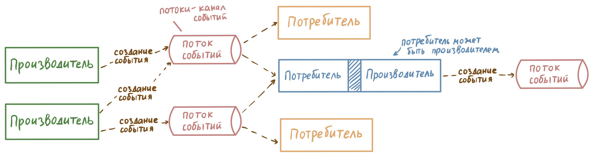
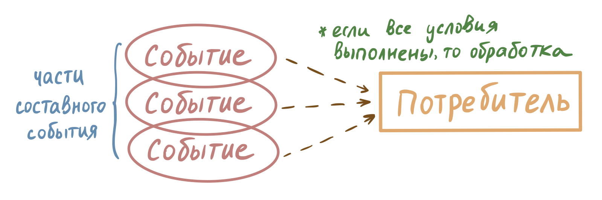
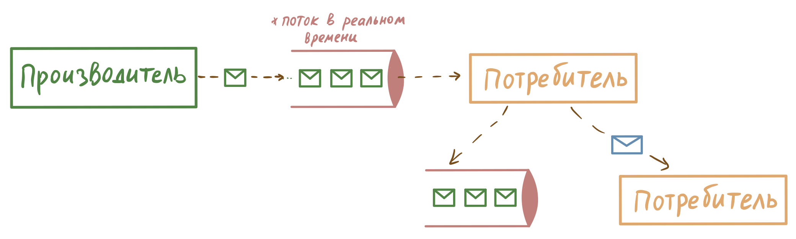

## **Архитектура ПО - управляемая событиями (event-driven architecture, EDA)**
### **Лебкова Марина, БПМ-22-2** 

###### 27 декабря 2023

___
##
**Архитектура, управляемая событиями** - шаблон архитектуры ПО, основанный на создании, обнаружении, потреблении и реакции на события. [5]

**EDA включает в себя:**
1. **События** - создание или изменение состояния сущности. В специальных логах сохраняются записи, содержащие метаданные и соответствующую информацию о событии. Упрощённо можно представить запись о событии JSON-файлом. Например, создание заказа:

 ``` 
{  
	"orderId": "760m5334-293f-4fec-95f8-6b303a3b824a",  
	"customerId": 235348767,  
	"productId": 4240,  
	"quantity": 5,  
	"timestamp": "2023-12-22T06:03:17+0000"  
}
```


2. **Генератор событий**: несёт ответственность за отправку событий. Производитель упаковывает данные о событии и отправляет их брокеру событий для последующего распространения.
5. **Канал событий (брокер):** механизм распространения информации, собранной от генераторов событий, в обработчики событий.
6. **Потребители (обработчики) событий**: потребители прослушивают входящие события и реагируют соответствующим образом.

О событиях не сообщается, они *просто происходят*. Программные компоненты публикуют данные, не зная, какие другие компоненты могут использовать данные и реагировать на них. 

Следовательно, производитель не прекратит работу, если потребители будут недоступны. Все записи сохраняются. Это способствует **отделению** вычислений и публикации событий от их последующей обработки, а также **асинхронной** работе ПО, что может положительно сказаться на производительности [2].

*Асинхронность - выполнение задач без ожидания завершения других задач.*

Таким образом, можно выделить следующие особенности EDA: [1]
## Особенности
- **Асинхронность и слабая связанность:** каждый компонент приложения EDA работает независимо, что позволяет им переходить к следующей задаче. Это также позволяет брокеру событий ставить полученные события в очередь, где они могут ожидать обработки до тех пор, пока не станет доступен их предполагаемый потребитель событий. 
- **Расширяемость:** новые компоненты могут быть добавлены в систему без необходимости изменения существующих компонентов, поскольку они могут быть связаны через обмен событиями.
- **Отказоустойчивость:** EDA может обеспечить более надежную обработку ошибок и обновлений, так как компоненты не являются прямо связанными друг с другом.
- **Гибкость:** EDA позволяет легко изменять и настраивать систему, так как компоненты могут быть добавлены, удалены или изменены без значительного влияния на другие компоненты.

**Схема:**


## Стили обработки событий
Обработка событий обычно подразделяется на три стиля [3]. Они не являются взаимоисключающими и часто встречаются вместе в больших системах.

### Обработка простых событий
Характеризуется событиями, которые обычно не связаны друг с другом и могут обрабатываться независимо. Такие события обычно сразу перенаправляются для инициирования действий. 
Например, после нажатия на кнопку должен выводиться текст "Кнопка нажата". 

### Обработка сложных событий
Обработка сложных событий выводит или идентифицирует сложные шаблоны событий из серии простых событий. 
Такого рода обработка более сложна. Она требует, чтобы обработчик событий отслеживал предыдущие события и обеспечивал эффективный способ их запроса и агрегирования.

### Обработка потока событий
Обработка неограниченного потока связанных событий, при которой записи о событиях отображаются в определенном порядке и могут обрабатываться с учетом некоторой информации о прошлых событиях. 

## Применение
Идеи EDA реализуются в событийно-ориентированном программировании [4]:
- в библиотеках и фреймворках для создания графического интерфейса (wxWidgets, ImGUI, Qt). Инициатором событий является пользователь.
- в веб-сервисах, обращении к серверам и др.

Сама архитектура, управляемая событиями, применяется в различных проектах, например: 
- интернет вещей
- электронная коммерция
- чат-боты и др.

## Список использованных источников
1. Карпович М. Н. Особенности проектирования микросервисно-событийных архитектур для высоконагруженных распределенных систем обработки информаций // Труды БГТУ. Сер. 3, Физико-математические науки и информатика. 2023. № 1 (266). С. 89–95. DOI: 10.52065/2520-6141-2023-266-1-15.
2. Eder F. Comparing Monolithic and Event-Driven Architecture when Designing Large-scale Systems // TRITA-EECS-EX; 2021:318, p.68
3. Event Processing Approaches In Event-Driven Architecture [Электронный ресурс] / https://www.3pillarglobal.com/insights/event-processing-approaches-in-event-driven-architecture/ (дата обращения: 27.12.2023)
4. Ferg S. Event-Driven Programming: Introduction, Tutorial, History [Электронный ресурс] / https://eventdrivenpgm.sourceforge.net/ (дата обращения: 27.12.2023)
5. Lazzari L., Farias K. Uncovering the Hidden Potential of Event-Driven Architecture: A Research Agenda [Электронный ресурс] / https://doi.org/10.48550/arXiv.2308.05270 (дата обращения: 27.12.2023)

